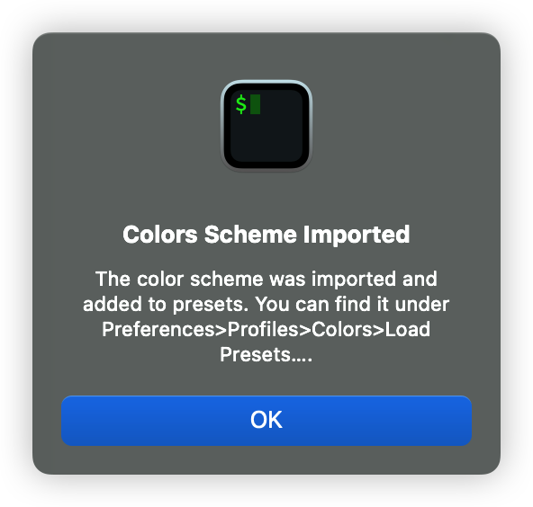

# iterm 꾸미기

#### oh-my-zsh 설치

```bash
sh -c "$(curl -fsSL https://raw.github.com/robbyrussell/oh-my-zsh/master/tools/install.sh)"
```

#### theme 설정

```bash
vi ~/.zshrc
###

# ZSH_THEME 찾아서 이렇게 변경
ZSH_THEME="agnoster"

# 맨 아래에 추가 - 유저명 커스텀
prompt_context() {
  if [[ "$USER" != "$DEFAULT_USER" || -n "$SSH_CLIENT" ]]; then
    prompt_segment black default "%(!.%

.)$USER 🚀"
  fi
}

# 맨 아래에 추가 - 현재 위치 폴더 2개까지만 보여주기
prompt_dir() {
  prompt_segment blue $CURRENT_FG '%2~'
}

###
source ~/.zshrc
```

#### zsh-syntax-highlighting & zsh-autosuggestions

```bash
brew install zsh-syntax-highlighting
brew install zsh-autosuggestions
vi ~/.zshrc
###
source /opt/homebrew/share/zsh-syntax-highlighting/zsh-syntax-highlighting.zsh
source /opt/homebrew/share/zsh-autosuggestions/zsh-autosuggestions.zsh
###
source ~/.zshrc
```

#### prompt에 k8s context 보여주기 (kubectx, kubens 필요)

```bash
vi ~/.oh-my-zsh/themes/agnoster.zsh-theme
###

# End the prompt, closing any open segments
prompt_end() {
  if [[ -n $CURRENT_BG ]]; then
    # 이 부분을
    # echo -n " %
{%k%F{$CURRENT_BG}%}$SEGMENT_SEPARATOR"
    # 이렇게 변경
    echo -n " %{%k%F{$CURRENT_BG}%}🚀"
  else
    echo -n "%"
  fi
  echo -n "%"
  CURRENT_BG=''
}

# 새로 추가 (build_prompt 위)
prompt_kubectx () {
  if [[ $(kubectx -c) == *"prod"* ]]; then
    prompt_segment bg red $(kubectx -c)%:%$(kubens -c)
  else
    prompt_segment bg yellow $(kubectx -c)%:%
$(kubens -c)
  fi
}

## Main prompt
build_prompt() {
  RETVAL=$?
  prompt_status
  prompt_virtualenv
  prompt_aws
  prompt_context
  prompt_dir
  prompt_git
  prompt_bzr
  prompt_hg
  prompt_kubectx # 추가
  prompt_end
}
```

#### color theme (w. Gogh)



```bash
bash -c  "$(curl -sLo- https://git.io/vQgMr)" 
118 입력 (Later This Evening)
```

<figure><figcaption><p>OK 해준다</p></figcaption></figure>

터미널에서 `Command + ,` 눌러 Preferences 진입

<figure><figcaption><p>Profiles > Colors > Color Presets</p></figcaption></figure>

<figure><figcaption><p>preset 선택</p></figcaption></figure>

#### 최종

<figure><figcaption></figcaption></figure>
